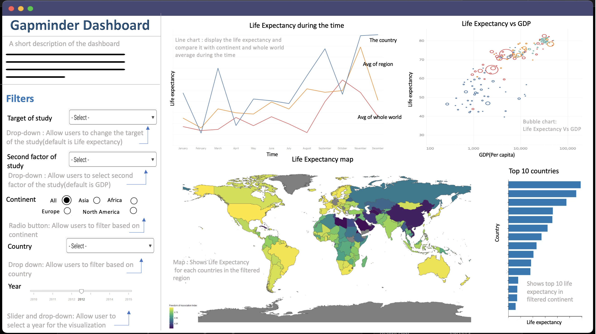

# Gapminder dashboard

## Decription of the app

The Gapminder dataset is a great source of information to learn about the world. The main objective of this app is to investigate what the young population of students know and don’t know about basic global patterns and macro-trends and educate the intended users on global development trends. This dashboard has been developed to communicate insights about historical social/economic trends and create a better understanding of using and teaching statistics.

## Dashboard Sketch Design

## Contributing 

Interested in contributing? Check out the contributing guidelines. Please note that this project is released with a Code of Conduct. By contributing to this project, you agree to abide by its terms.

## Contributors

This app was developed by the following Master of Data Science program candidates at the University of the British Columbia:

- Mel Liow                [@mel-liow](https://github.com/mel-liow)
- Anupriya Srivastava     [@Anupriya-Sri](https://github.com/Anupriya-Sri)
- Mohammadreza Mirzazadeh [@rezam747](https://github.com/rezam747)
- Arijeet CHATTERJEE      [@arijc76](https://github.com/arijc76)

## License

`gapminder_dashboard_R` was created by Mel, Anupriya, Reza and Arijeet. It is licensed under the terms of the MIT [license](https://github.com/UBC-MDS/gapminder_dashboard_R/blob/main/LICENSE).
